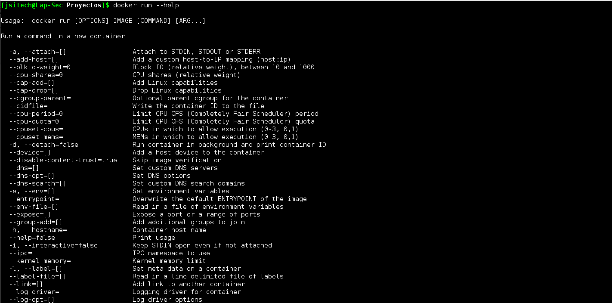
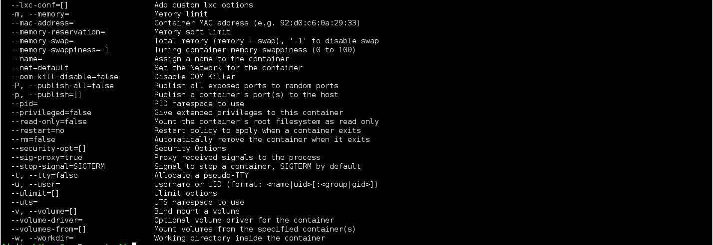

# Comando Docker Run

A lo largo de esta guía hemos mencionado algunas veces a ```docker run```, pero solo lo básico. Dado que es un comando que usaremos mucho, obviamente, quiero dedicarle un poco de tiempo ya que es mucho lo que podemos hacer con el, al momento que estamos lanzando un contenedor. 

    $ docker run [opciones] [imagen] [comandos] [árgumentos]

Cuando ejecutamos ```docker run``` debemos especificar una imagen que usaremos de base al momento de lanzar el contenedor, otro punto es que las opciones pueden sustituir casi todos los valores predeterminados configurados en la ejecución, ver la entrada de los Dockerfile para que vean a que me refiero.


### Opciones


### Detached y Foreground


Cuando lanzamos el contenedor por defecto corre en modo foreground y atacha la consola en la entrada y salida estándar del proceso. Puede pretender incluso ser un tty que es lo que esperan muchos de los ejecutables. Todo esto es configurable

    -a=[]       : Atacha a `STDIN`, `STDOUT` o `STDERR`

    -t=false   : Asigna un pseudo-tty

    –sig-proxy=true : Captura todas las señales y las envía al proceso (modo non-TTY)

    -i=false : Mantiene STDIN abierto aun no esté atachado

Si no se especifica nada con ```-a```, Docker atachara todos los streams.

**Ejemplo:**

    $ docker run -a stdout -i -t centos:centos7

Si pasamos la opción ```-d```, el contenedor se lanzará en modo Detached. En este modo cuando el proceso raíz haya finalizado el contenedor se detiene. Debemos tener pendiente que si le pasamos un comando al contenedor en la ejecución, una vez el comando se ejecute, se detendrá. Es por esto que siempre debemos configurar muy bien lo que deseamos en los Dockerfiles, específicamente hablando los ```EntryPoints``` y ```CMD```.

**Ejemplo:**

    $ docker run -i -t -d centos:centos /bin/bash


### Identificando los Contenedores


Cuando lanzamos un contenedor el daemon de Docker lo identifica con 3 valores:

    UUID Largo
    UUID Corto
    Nombre

Docker por defecto le asigna un nombre aleatorio al contenedor. Este nombre lo podemos utilizar para interactuar de diversas maneras, algunos ejemplos serían, obtener algunos detalles del contenedor, detenerlo, reiniciarlo y mas. Este nombre lo podemos obtener cuando ejecutamos un ```docker ps```. Este nombre podemos configurarlo como deseemos, de esta manera podemos identificar el contenedor con sus funciones por ejemplo. Esto lo hacemos con la opción ```--name```.

**Ejemplo:**

    $ docker run -i -t -d –name=”webserver” -p 80:80 centos:webimage /bin/bash


### Configuración de Red


Por defecto los contenedores tienen las conexiones de redes habilitadas y pueden hacer conexiones salientes sin restricciones. Podemos deshabilitar esto por completo pasando la opción``` --net none```. En estos casos las conexiones de entrada y salida se hacen por archivos y los streams estándar.

    –dns=[] : Configurar dns al contenedor

    –net=”bridge” : Conecta el contenedor a una red

            ‘bridge’: crea un nuevo stack para el contenedor en el puente de docker

            ‘none’: Sin conexión de red

            ‘container:<name|id>’: Reutiliza el stack de conexiones de otro contenedor

           ‘host’: Usa el stack de conexiones del host en el contenedor

           ‘NETWORK’: conecta el contenedor a una red creada por el usuario mediante el comando `docker network create`

    –add-host=”” : Agrega una linea a /etc/hosts (host:IP) –mac-address=”” : Configura la MAC del contenedor

**Nota**: Cuando usamos la opcion host le da al contenedor acceso por completo a los servicios del sistema local por lo que se considera Inseguro.

**Algunos Ejemplos:**

Configurando los DNS en el contenedor

    $ docker run -i -t –dns=”8.8.8.8” centos:centos7 /bin/bash

Agregando una entrada en /etc/hosts del contenedor

    $ docker run -i -t –dns=”8.8.8.8” –add-host webserver:10.0.0.5 centos:centos7 /bin/bash

Crear una red y conectar el contenedor a ella

    $ docker network create -d overlay mi-red

    $ docker run –net=mi-red -i -t -d centos:centos7


### PID


    –pid=”” : Configura el espacio de nombre PID para el contenedor

    ‘host’ : Utiliza el espacio de nombre del host dentro del contenedor

Ejemplos:

    $ docker run –pid=host centos7 strace -p 123

Esto le permite al contenedor ver todos los procesos en el host. Es util cuando se desea correr procesos de depuración o lo que necesiten en el host pero desean hacerlo desde el contenedor.
Políticas de Reinicio

Usando ```--restart``` podemos especificar una política de reinicio de como un contenedor debe o no debe reiniciarse. Docker Soporta las Políticas:

    no : No reiniciarse cuando se detiene un contenedor, este es el predeterminado

    on failure : Reiniciar el contenedor cuando se detiene por un status de salida non-zero.

    Always: Siempre reinicia el contenedor independiente del status de salida. Iniciará el contenedor por igual al momento que se lanza el daemon de Docker.

    Unless-stopped: Reiniciar siempre el contenedor independiente del status de salida, pero no iniciarlo cuando se ejecute el daemon de docker si se detuvo previamente.

Ejemplo:

    $ docker run –restart=always centos:centos7

    $ docker run –restart=on-failure:20 centos:centos7


### Limitando los Recursos usados por los contenedores


| -m, --memory=”” | Límite Memoria (formato: <valor>[<unidad>], donde unidad= b, k, m or g) |
| -- | -- |
| --memory-swap=”” | Total límite de memoria (memory + swap, formato: <valor>[<unidad>], donde unidad = b, k, m or g) |
| --memory-reservation=”” | Límite flexible de memoria (formato: <valor>[<unidad>], donde unidad= b, k, m or g) |
| --kernel-memory=”” | Límite memoria Kernel (formato: <valor>[<unidad>], donde unidad= b, k, m or g) |
| -c, --cpu-shares=0 | CPU (peso relativo) |
| --cpu-period=0 | Limitar Período CPU CFS (Completely Fair Scheduler) |
| --cpuset-cpus=”” | CPUs en donde permitir ejecución (0-3, 0,1) |
| --cpuset-mems=”” |Nodos de memoria en donde permitir ejecución (0-3, 0,1) |
| --cpu-quota=0 |Limitar cuota CPU CFS (Completely Fair Scheduler) |
| --blkio-weight=0|Bloquear Peso IO (Peso relativo) aceptar valor de peso entre 10 y 1000. |
| --oom-kill-disable=false | Desahabilitar OOM Killer para el contenedor |
| --memory-swappiness=”” |Configurar el comportamiento d Swappines del contenedor |


### Límites de uso de Memoria

| memory=inf, memory-swap=inf (default) | No hay límites de memoria para el contenedor |
| -- | -- |
| memory=L<inf, memory-swap=inf | (Especificar memoria y configurar memory-swap como -1) El contenedor no puede usar más de la memoria especificada por L, pero puede usar toda la memoria swap que necesite |
| memory=L<inf, memory-swap=2*L |(Especificar memoria sin memory-swap) El contenedor no puede usar mas de la memoria especificada por L, y usar el doble como swap |
|memory=L<inf, memory-swap=S<inf, L<=S| (Especificar memoria y memory-swap) El contenedor no puede usar más de la memoria especificada por L, y la memoria Swap especificada por S |


**Ejemplos:**

    $ docker run -i -t -d -m 500m centos:centos7 /bin/bash

    $ docker run -i -t -d -m 500m --memory-swap 2G centos:centos7 /bin/bash

**Otros Ejemplos:**

    $ docker run -i -t -d --cpuset-cpus=”1” centos:centos7 /bin/bash

    $ docker run -i -t -d --cpuset-mems=”0-2” centos:centos7 /bin/bash

    $ docker run -i -t -d --memory-swappiness=0 centos:centos7 /bin/bash

**--entrypoint**=”” : Sobreescribe el entrypoint especificado en el Dockerfile

**Ejemplo:**

    $ docker run -i -t -d --entrypoint /bin/bash centos:centos7

**--expose=[]** : Expone un puerto o un rango en el contenedor

**Ejemplos:**

    $ docker run -i -t -d --expose=80 -p 80:80 centos:centos7 /bin/bash

Si la imagen creada ya tiene por defecto los puertos expuesto solo debemos mapear los puertos

    $ docker run -i -t -d -p 80:80 centos:centos7 /bin/bash

    $ docker run -i -t -d --expose=80 -P centos:centos7 /bin/bash

**Nota**: ```-P``` mapea todos los puertos expuestos en el contenedor a puertos aleatorios en el Host.

**-v=[] **: Enlaza un Directorio en el host al contenedor o crea un volumen

**Ejemplos:**

    $ docker run -i -t -d -v /home/jsitech/sitio/:/var/www/html/ -p 80:80 centos:centos7 /bin/bash

**-u=”” **: Configura el usuario por defecto dentro del contenedor

**Ejemplos:**

    $ docker run -i -t -d –expose=80 -p 80:80 -u jsitech centos:centos7 /bin/bash

Estas serían las opciones que mas estaríamos utilizando con ```docker run```. Acá les dejo todas las opciones de docker run, que pueden visualizarlas ejecutando un ```docker run –help```.


