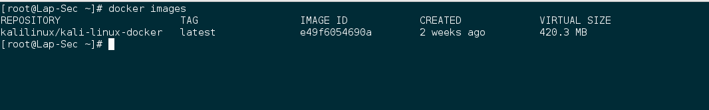
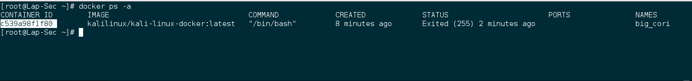
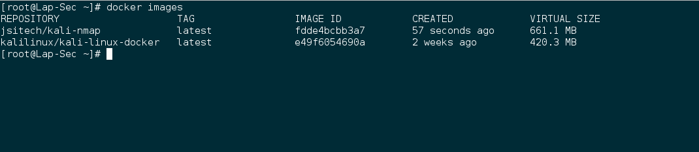

# Creando Imágenes

las imágenes son plantillas de solo lectura que podemos usar como base para lanzar contenedores. Esto quiere decir que lo que hagamos en el contenedor solo persiste en ese contenedor, esas modificaciones no lo hacemos en la imagen, es decir, que si queremos contar con una imagen personalizada debemos crearla para nuestros futuros contenedores. En este apartado vamos a ver como podemos crear una imagen desde un contenedor que ya hemos personalizado.

### Creando imágenes desde un contenedor

Esta puede ser la manera más sencilla de crear una imagen, ya que lanzamos un contenedor, descargamos paquetes por ejemplo y podemos crear una imágen a partir de ahí para utilizarla como base en futuros contenedores. Vamos a ver como lo podemos hacer.

Lo primero es que debemos lanzar un contenedor con una imágen, en este caso tenemos un contenedor basado en Kali Linux, y queremos crear una imágen que tenga NMAP ya instalado.

Confirmo las imágenes

    $ docker images

Lanzamos el contenedor con la imágen que tenemos de Kali.

    $ docker run -i -t kalilinux/kali-linux-docker:latest /bin/bash

Ya dentro del contenedor instalamos NMAP

    root@c539a98f1f80:/# apt-get update

    root@c539a98f1f80:/# apt-get install nmap

**Ya que lo instalamos, como creo una imágen a partir de este contenedor para contar con una imágen con Nmap preinstalado?**

Salimos del contenedor

    root@c539a98f1f80:/# exit

Vamos ahora a mostrar todos los contenedores que hemos lanzado aún no esten corriendo

    $ docker ps -a
    

Aquí vemos listado el último contenedor que lanzamos, solamente debemos tomar el **CONTAINER ID** para hacer un commit a una nueva imagen

    $ docker commit c539a98f1f80 jsitech/kali-nmap:latest

Docker creará la imágen, confirmemos que es asi, listando las imágenes que tenemos y debemos tener la que acabamos de crear.

    $ docker images

Efectivamente, ahí tenemos la imágen que creamos a partir del contenedor donde instalamos nmap

Esto es una forma sencilla de crear una imágen, pero es posible que necesitemos un poco más de personalización en nuestra imágen, que tome ciertos parámetros y que esta tal vez ejecute algo cuando se usen para lanzar contenedores además de que nos faciliten la manera de compartir estas imágenes en un grupo de desarrollo por ejemplo. Este nivel de personalización podemos lograrlo con los Dockerfiles.