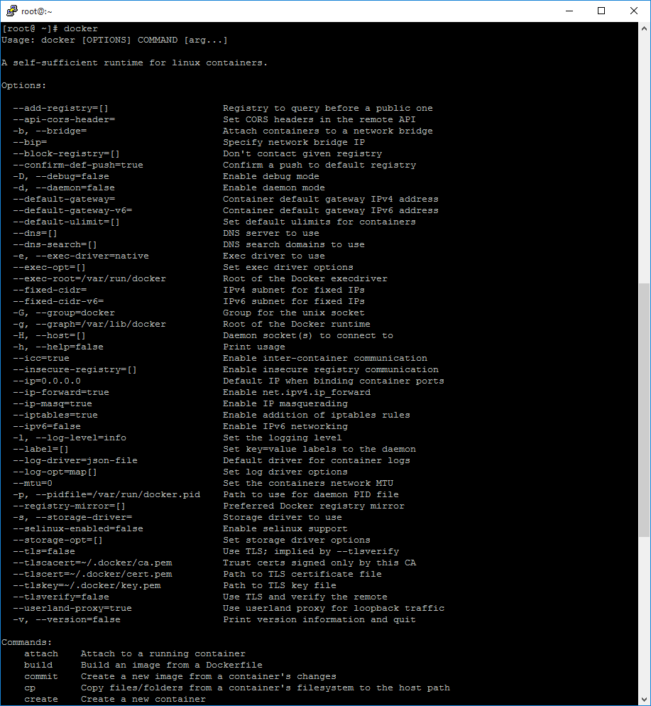

# Instalando Docker
En esta guía veremos la instalación de Docker en CentOS y Ubuntu.


### CentOS 6


**Instalamos el Repo EPEL
**

    $ rpm –Uvh http://dl.fedoraproject.org/pub/epel/6/x86_64/epel-release-6-8.noarch.rpm


### CentOS 7


    $ rpm –Uvh http://dl.fedoraproject.org/pub/epel/7/x86_64/e/epel-release-7-5.noarch.rpm

**Procedemos con la instalación de Docker**


### CentOS 6/7


    $ yum install docker-io


### Ubuntu 14.04/15.04


    $ apt-get update

    $ apt-get install docker.io

### Debian 7/8

``````
$ apt-get purge lxc-docker*
$ apt-get purge docker.io*
``````

**Agregamos la nueva llave gpg
**
``````
 $ apt-key adv --keyserver hkp://p80.pool.sks-keyservers.net:80 --recv-keys 58118E89F3A912897C070ADBF76221572C52609D
 ``````
 
**Agregamos los repos de Docker
**

``````
$ nano /etc/apt/sources.list.d/docker.list
``````

**Debian 7
**
``````
deb https://apt.dockerproject.org/repo debian-wheezy main
``````

**Debian 8
**
``````
deb https://apt.dockerproject.org/repo debian-jessie 
``````
``````
$ apt-get update
$ apt-get install docker-engine
``````

**Una vez instalamos vamos asegurarnos que el servicio de Docker suba cada vez que booteemos nuestros servers.
**

### Centos 6


    $ chkconfig docker on


### Centos 7


    $ systemctl enable docker.service


### Ubuntu 14.04/15.04


    $ chkconfig docker.io on


Iniciamos los servicios para asegurarnos que todo anda bien.


### CentOS 6


    $ service docker start


### Centos 7


    $ systemctl start docker.service


### Ubuntu 14.04/15.04


    $ service docker.io start


### Debian 7/8

    $ service docker start
    
    
Ya que tenemos el ambiente listo. Vamos a ejecutar el commando Docker a ver que nos trae.

    $ docker




Nos trae información sobre las opciones que le podemos pasar a docker. Recuerdan que el post anterior hablamos de los registros de Docker o Docker Registries que es un repo con diversas imágenes para descargar, para probar que todo anda bien, vamos a realizar una busqueda de alguna imagen y vamos a descargarla.

    $ docker search Ubuntu


Aquí vemos una lista de imágenes disponible. Vamos a descargar la imagen base de Ubuntu

    $ docker pull docker.io/Ubuntu

O

    $ docker pull Ubuntu:latest

Nota: deben pasar el nombre de la imagen como les aparece en la busqueda

Si ejecutamos docker images debemos ver la imagen descargada.

    $ docker images


Si podemos realizar todas estas tareas nuestra instalación esta correcta.