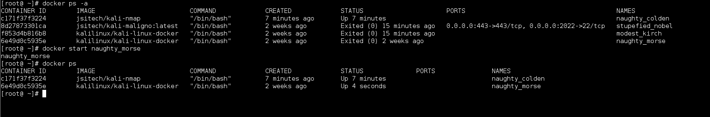

# Otros Comandos

En esta entrada lo que veremos son los otros comandos que podemos usar para interactuar con los contenedores. Lo veremos a modo de **Cheat Sheet**.

Vamos a ver algunos de ellos.

Si corremos docker en la linea de comandos nos devolverá una lista de las opciones

    $docker
    


Vamos a ver ahora que hacen cada uno

**docker ps **: Muestra los contenedores que están corriendo, si le pasamos -a nos mostrará también los contenedores que hemos detenido

**Ejemplo**:

    $ docker ps

    $ docker ps -a


**docker attach :** Se conecta a un contenedor que esta corriendo, podemos hacerlo por el nombre o por el ID de contenedor

Ejemplo:

    $ docker attach c171f37f3224

    $ docker attach naughty_colden

**docker start :** Reinicia un contenedor detenido. Lo podemos hacer por el Nombre o el ID

**docker stop :** Detiene un contenedor

Ejemplo:

    $ docker start naughty_colden



**docker diff :** Lista los cambios hechos en el sistema de arhivos de un contenedor. Hay 3 eventos que muestra

A – Agregado

D – Eliminado

C – Cambio


**Ejemplo:
**

    $ docker diff naughty_morse


**docker events :** Muestra eventos en tiempo real del estado de los contenedores.

**Ejemplo:
**

    $ docker events


**docker exec :** Ejecuta un comando en un contenedor activo

Ejemplo:

    $ docker exec -d kali/kali-nmap touch /tmp/file

docker inspect: Muestra informaciones de bajo nivel del contenedor o la imagen

**Ejemplo**

    $ docker inspect naughty_morse

    $ docker inspect naughty_morse | grep IPAddress


**docker export :** Exporta el contenido del sistema de archivo de un contenedor a un archivo tar

**Ejemplo:
**

    $ docker export naughty_morse > kalicont.tar

    $ docker export -o kalicont.tar naughty_morse

**docker search : **Busca una imagen en el registro de docker

**Ejemplo:
**

    $ docker search ubuntu


**docker pull :** Descarga una imagen del registro de Docker

**Ejemplo:
**

    $ docker pull docker.io/ubuntu

**docker history :** Muestra el historial de una imagen

**Ejemplo:
**

    $ docker history jsitech/kali-nmap


**docker images :** Muestra las imágenes que tenemos disponible localmente

**Ejemplo:
**

    $ docker images


**docker kill :** Detiene un contenedor enviando un SIGKILL.

**Ejemplo:
**

    $ docker kill naughty_morse

**docker load :** Carga una imagen desde un archivo tar

**Ejemplo:
**

    $ docker load –input kalicont.tar

    $ docker load < kalicont.tar

**docker rmi :** Elimina una o mas imagen. Si la imagen a borrar tiene un contenedor dependiente, se deben eliminar esos contenedores con docker rm para poder borrar la imagen

**Ejemplo:
**

    $ docker rmi jsitech/kali-nmap

**docker rm :** Elimina uno o mas contenedores.

**Ejemplo:
**

    $ docker rm 6e49d0c5935e

El **id** lo podemos obtener con un ```docker ps -a```

**docker login :** Se registra o loguea en un servidor de registro de Docker, si no se especifica el servidor “https://index.docker.io/v1/” es el seleccionado por defecto

**Ejemplo:
**

    $ docker login 10.0.0.10:8080

    $ docker login -e jason_soto@jsitech.com -p 123 -u jsitech 10.0.0.10:8080

**docker logout :** Se desconecta del servidor de registro de docker.

**Docker stats :** Muestra el uso de recursos de los contenedores

**Ejemplo:
**

    $ docker stats naughty_colden


**docker build :** Crea una imagen a partir de un DockerFile

**Ejemplo:
**

    $ docker build jsitech/kali-nmap .

    $ docker build jsitech/kali-nmap -f /ruta/Dockerfile

**docker commit :** Crea una imagen a partir de un contenedor

**Ejemplo:
**

    $ docker commit c171f37f3224 jsitech/kali-nmap

**docker pause :** Congela todos los procesos en un contenedor

**Ejemplo:
**

    $ docker pause naughty_colden

**docker rename :** Renombra un contenedor con el nombre deseado

    $ docker rename naughty_colden jsitech_kali


### Daemon de Docker


```Opciones:
  --api-cors-header=""                  Configura los Headers CORS a un API remoto
  -b, --bridge=""                       Conecta los contenedores a un puente de red
  --bip=""                              Especificar la IP del puente de red
  -D, --debug=false                     Habilitar modo de depuración
  --default-gateway=""                  Gateway por defecto IPv4
  --default-gateway-v6=""               Gateway por defecto IPv6
  --dns=[]                              Servidor DNS a utilizar
  --dns-search=[]                       Dominios de búsqueda DNS a utilizar
  --default-ulimit=[]                   Configurar Ulimit a los contenedores
  -e, --exec-driver="native"            Driver Exec a utilizar
  --exec-opt=[]                         Configurar opciones Driver Exec
  --exec-root="/var/run/docker"         Ruta del execdriver de docker
  --fixed-cidr=""                       Subred Ipv4 para direcciones fijas
  --fixed-cidr-v6=""                    Subred Ipv6 para direcciones fijas
  -G, --group="docker"                  Grupo para el socker de Unix
  -g, --graph="/var/lib/docker"         Ruta del runtime de Docker
  -H, --host=[]                         Sockets de Conexión del Daemon de Docker
  -h, --help=false                      Mostrar ayuda
  --icc=true                            Habilitar comunicación entre contenedores
  --insecure-registry=[]                Habilitar comunicación insegura al registro
  --ip=0.0.0.0                          IP por defecto al mapear los puertos
  --ip-forward=true                     Habilitar net.ipv4.ip_forward
  --ip-masq=true                        Habilitar IP masquerading
  --iptables=true                       Habilitar Reglas de Iptables
  --ipv6=false                          Habilitar comunicaciones IPv6
  -l, --log-level="info"                Configurar nivel de logging
  --label=[]                            Configurar etiqueta al daemon
  --log-driver="json-file"              Driver predeterminado para logs
  --log-opt=[]                           Opciones para el Driver de logs
  --mtu=0                                configurar MTU
  -p, --pidfile="/var/run/docker.pid"    Ruta PID daemon
  --registry-mirror=[]                   Registro de Docker preferido
  -s, --storage-driver=""                Driver de almacenamiento a utilizar
  --selinux-enabled=false                Habilitar Soporte para Selinux
  --storage-opt=[]                       Opciones para driver de almacenamiento
  --tls=false                            Usar TLS;  --tlsverify
  --tlscacert="~/.docker/ca.pem"         Confiar solo en este CA
  --tlscert="~/.docker/cert.pem"         Ruta Certificado
  --tlskey="~/.docker/key.pem"           Ruta llaves
  --tlsverify=false                      Usar TLS y verificar el remoto
  --userland-proxy=true                  usar proxy para tráfico Loopback
```


### Crear un Puente de red y conectar los contenedores a el.


**Pasos ejecutados en Centos
**

    $ ip link add br10 type bridge

    $ ip addr add 10.0.100.1/24 dev br10
    $ ip link set br10 up

    $ docker -d -b br10 &

Al ejecutar estos pasos, al momento de lanzar los contenedores tomarán una IP del rango que especificamos.