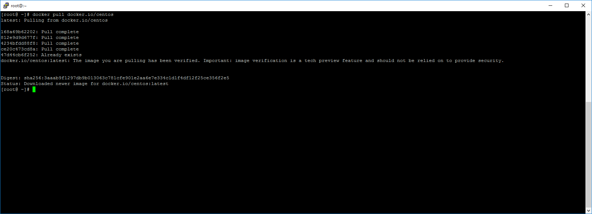
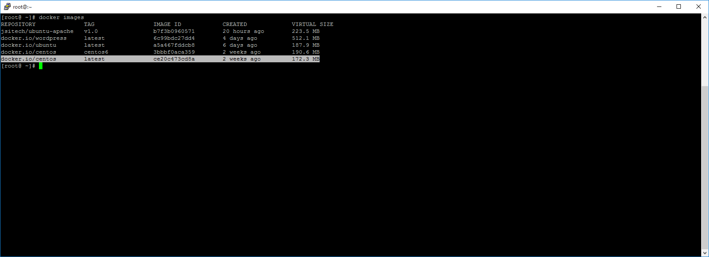
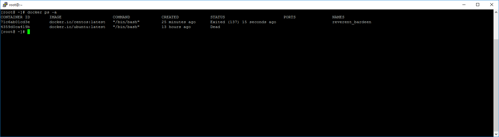

# Primeros Pasos con Docker

En Capítulos anteriores vimos lo que es Docker y como instalarlo en Linux CentOS y Ubuntu. Pero antes de entrar de lleno con Docker, recuerdan que les hablaba de Docker registries, quiero hablarles brevemente de **Docker Hub**.


**Docker Hub** es un servicio de registro basado en la nube para crear y entregar contenedores de servicio o aplicaciones. Provee un recurso centralizado para el descubrimiento de contenedores, distribución, control de cambios, colaboración de equipos y automatización de flujos de trabajo. Veanlo como como un** Github** de contenedores.

Características de Docker Hub

* **Repositorios de Imágenes**: Encuentra, administra, sube y descarga imágenes de la comunidad y oficiales

* **Imágenes automáticas**: Crea nuevas imágenes cuando haces un cambio en la Fuente de Github o BitBucket

* **Webhooks**: creaciones automáticas de imágenes al hacer un push exitoso a un repositorio.

* **Integración con GitHub y BitBucket**


Docker Hub le provee a usted y su organización un lugar donde alojar y entregar las imágenes.

Se puede configurar los repositorios de Docker Hub de dos maneras:


**Repositorios**, que nos permiten subir y actualizar las imágenes cuando deseemos desde el docker daemon y las **imágenes automáticas** que nos permiten configurar una cuenta de Github o BitBucket que desencadenan la reconstrucción de una imágen cuando se realizar algún cambio en el repositorio.


Se pueden crean repositorios públicos que pueden ser accedidos por otros usuarios de HUB, o se pueden crear repositorios privados con accesos limitados.

Pueden crear su cuenta en https://hub.docker.com, luego veremos como podemos aprovechar todo esto.

El daemon de Docker hace uso de Hub para obtener y subir sus imágenes. Ya que tenemos una base, vamos a jugar un poco con Docker.

**Busquemos una imagen base de Centos
**

    $ docker search centos


Vamos a descargar la imagen official base de centos. Asi que nos fijamos en NAME y lo pasamos al docker pull

    $ docker pull docker.io/centos



Otra forma que podemos usar para buscar una imagen es mediante el Hub.

Si hacemos la búsqueda de centos tendremos algo así.


Aquí tenemos el comando y los tags para obtener una version específica. Si ven tenemos como comando docker pull centos, y si deseamos por ejemplo descargar la version 7 de centos o la última version, los comandos se verían así.

    $ docker pull centos:centos7

    $ docker pull centos:latest

Ya descargada la imagen, confimamos que este ahí con

    $ docker images

```docker.io/centos       latest             ce20c473cd8a       2 weeks ago         172.3 MB
```



Ya vemos que tenemos la imagen ahí. Ahora como podemos interactuar con esa imagen o lanzar un contenedor con esa imagen? A eso vamos, pero antes recuerden esto, cuando lanzamos un contenedor, y hacemos cualquier tarea esto no se ve reflejado al momento de lanzar otro contenedor con la misma imagen

Vamos a lanzar un contenedor basado en esa imagen e interactuar con la linea de comandos de ese contenedor

    $ docker run –i –t docker.io/centos:latest /bin/bash

-i : Interactivo

-t: tty

[root@71c6ab01cd3e /]#


Aquí ya estamos interactuando con el contenedor, esa numeración que ven luego de root es el id del contenedor, podemos actualizar el Sistema, instalar paquetes, etc. Este contenedor tambien cuenta con una IP con la que podemos interactuar con el contenedor.

Veamos los contenedores que tenemos corriendo. Abran otra terminal en el server.

    $ docker ps


Aquí tenemos el ID de contenedor, la imagen que usamos para lanzarlo, el comando que corrimos y al final el Nombre. Con este nombre que docker le asignó aleatoreamente podemos interactuar con el contenedor. Este Nombre por igual lo podemos asignar nosotros.

Si queremos detener el contenedor

    $ docker stop reverent_bardeen (que es el nombre asignado por docker)

Si corremos docker ps, veremos que ya no hay nada. Lo Bueno del caso es que ese contenedor permanece ahi, con los cambios que nosostros le realizamos.

    $ docker ps –a



Podemos reiniciar nuevamente ese contenedor y conectarnos a el

    $ docker start reverent_barden

    $ docker attach reverent_barden


Aquí estamos nuevamente conectado con nuestro contenedor.